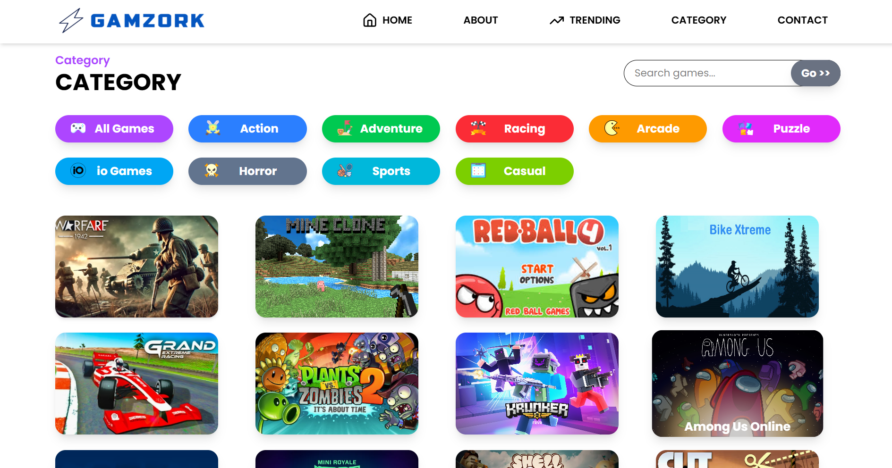
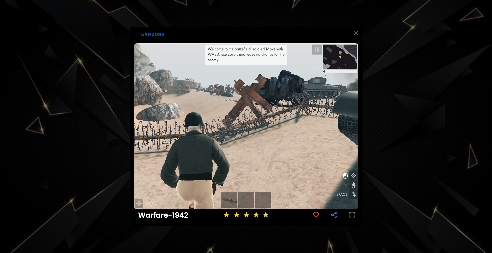

# ⚡GamZork

**GamZork** is a free-to-play gaming website built with **HTML, CSS, and JavaScript**.  
It brings together a collection of simple, fun, and lightweight browser games — no downloads, no sign-ups, just pure gaming fun in your browser.  

---

## 🌟 Features
- 🕹️ **Free to Play** – All games are 100% free.  
- ⚡ **Lightweight & Fast** – Built with plain HTML, CSS, and JS.   
- 🎯 **Multiple Games** – Play action, puzzle, and arcade-style games.    

---

## 📂 Project Structure
```
GamZork/
├── index.html # Landing page / home
├── cover.html # Main game page
├── mstyle.css # Global styles
├── mscript.js # Core JavaScript logic
├── game img/ # Images, icons, audio files
└── README.md # Project documentation
```
---

## 🚀 Getting Started

### 1. Clone the repository
```bash
git clone https://github.com/<your-username>/GamZork.git
cd GamZork
python -m http.server 8000
```
Then visit 👉 `http://localhost:8000`

---

## 📸 Screenshots
### Landing page


### Category Section


### Game Play


---

## 🛠️ Tech Stack

HTML, CSS, JavaScript

---

🤝 Contributing

Contributions are welcome! 🎉

If you’d like to add new games, improve UI, or fix bugs:

-> Fork this repo
-> Create a new branch (feature-new-game)
-> Commit your changes
-> Open a Pull Request 🚀

---

📜 License

This project is licensed under the MIT License – you’re free to use, modify, and distribute it.

---

💡 Inspiration

GamZork was created to bring together fun, simple browser games in one place, accessible to everyone, for free.

